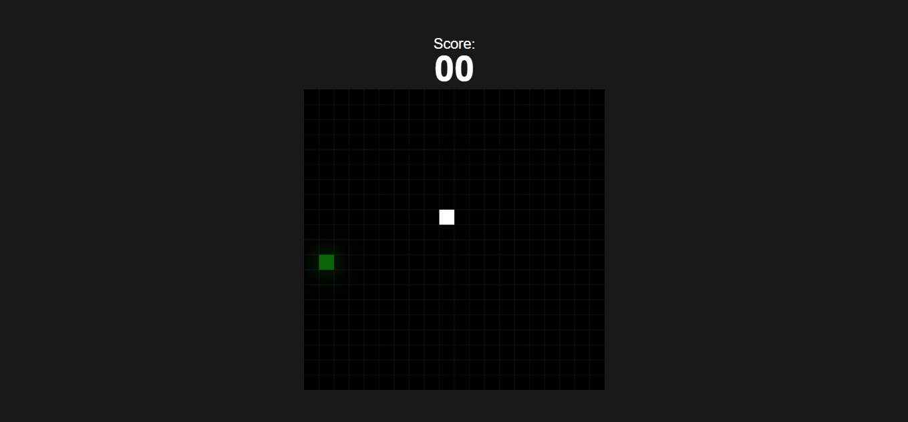

# 🐍 Snake Game – Aplicação Front-End

Aplicação Front-End de Jogo da Cobrinha, desenvolvida com HTML, CSS e JavaScript, com foco em lógica de programação, controle de estados e manipulação do canvas.

## 🖥️ Demonstração
🔗 Site online: https://snake-game-cyan-two.vercel.app/  
🔗 Repositório: https://github.com/mellacer/snake-game  

## 📸 Preview


## 🛠️ Tecnologias
- HTML5
- CSS3
- JavaScript
- Canvas API

## ✨ Destaques
- Renderização do jogo utilizando o elemento `<canvas>`
- Lógica de movimentação da cobrinha baseada em coordenadas
- Sistema de colisão com paredes e com o próprio corpo
- Geração aleatória de comida com cores dinâmicas
- Sistema de pontuação em tempo real
- Tela de fim de jogo com exibição da pontuação final

## 📚 Objetivo
Projeto desenvolvido com fins educacionais, com foco no aprimoramento de:
- Lógica aplicada a jogos 2D
- Manipulação de gráficos com Canvas API
- Controle de estados e loops de jogo
- Detecção de colisões
- Organização de código em JavaScript puro

## 📱 Responsividade
Este projeto não possui responsividade e foi desenvolvido com foco em execução em desktop, utilizando controles via teclado.

## 🚀 Execução do Projeto
```bash
# Clone o repositório
git clone https://github.com/mellacer/snake-game

# Acesse a pasta
cd snake-game

# Abra o index.html no navegador
